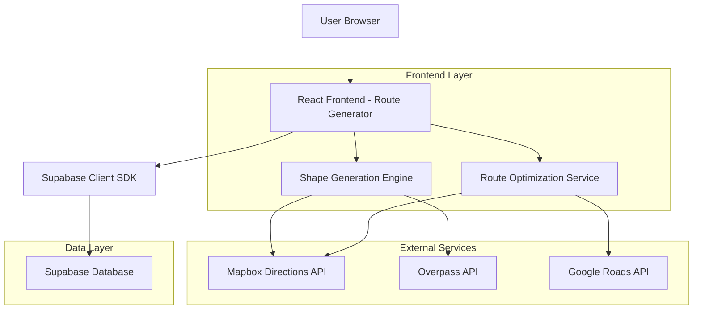
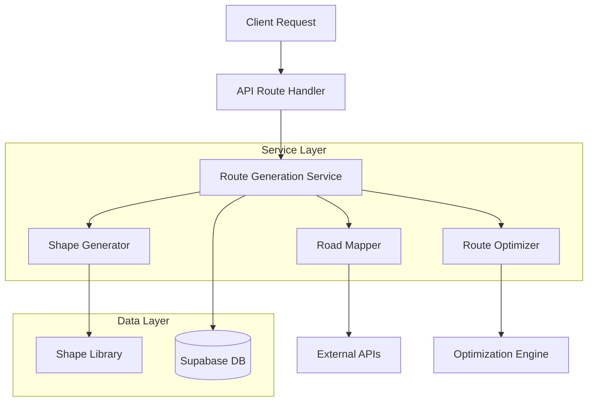
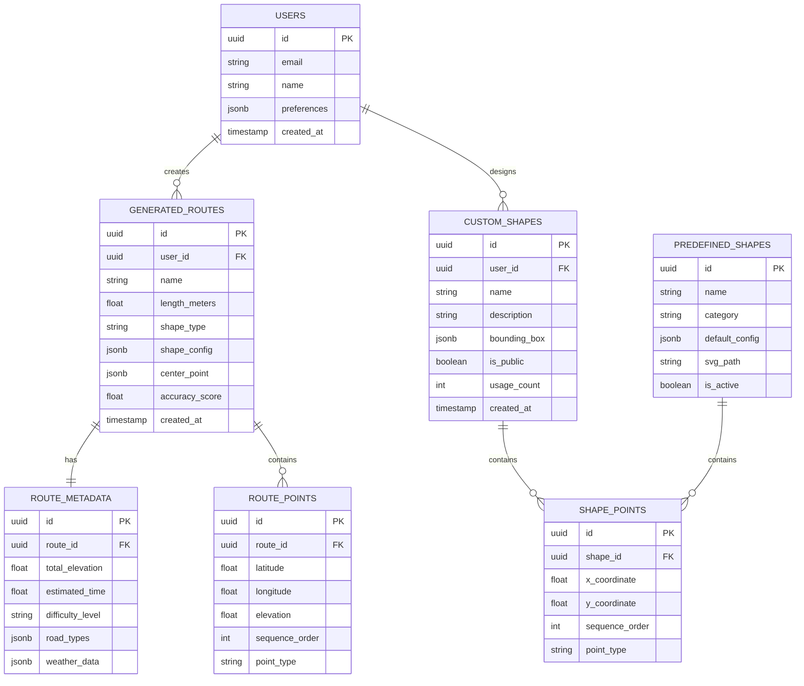

# Tehnička Arhitektura - Napredna Funkcionalnost Generisanja Ruta

## 1. Arhitektura Dizajna



## 2. Opis Tehnologija

* Frontend: React\@18 + TypeScript + TailwindCSS\@3 + Vite

* Mapping: Mapbox GL JS + Turf.js (geometrijske kalkulacije)

* Backend: Supabase (PostgreSQL + Auth + Storage)

* External APIs: Mapbox Directions API, Overpass API, Google Roads API

* State Management: Zustand

* Validation: Zod

* Testing: Vitest + React Testing Library

## 3. Definicije Ruta

| Ruta                      | Svrha                                                     |
| ------------------------- | --------------------------------------------------------- |
| /route-generator          | Glavna stranica za generisanje ruta sa naprednim opcijama |
| /route-generator/shapes   | Galerija predefinisanih oblika i custom kreacija          |
| /route-generator/preview  | Pregled generirane rute pre čuvanja                       |
| /saved-routes             | Lista sačuvanih ruta sa filter opcijama                   |
| /route-generator/settings | Konfiguracija algoritma i preferencija                    |

## 4. API Definicije

### 4.1 Core API

**Generisanje rute**

```
POST /api/routes/generate
```

Request:

| Param Name  | Param Type       | isRequired | Description                |
| ----------- | ---------------- | ---------- | -------------------------- |
| length      | number           | true       | Dužina rute u metrima      |
| shape       | ShapeConfig      | true       | Konfiguracija oblika       |
| center      | LatLng           | true       | Centar mape za generisanje |
| preferences | RoutePreferences | false      | Dodatne preferencije       |

Response:

| Param Name | Param Type     | Description                      |
| ---------- | -------------- | -------------------------------- |
| route      | GeneratedRoute | Generisana ruta sa koordinatama  |
| metadata   | RouteMetadata  | Metapodaci o ruti                |
| accuracy   | number         | Procenat tačnosti oblika (0-100) |

Example:

```json
{
  "length": 5000,
  "shape": {
    "type": "predefined",
    "name": "heart",
    "complexity": "moderate"
  },
  "center": {
    "lat": 44.7866,
    "lng": 20.4489
  },
  "preferences": {
    "roadType": "paved",
    "avoidHighways": true
  }
}
```

**Pretraga oblika**

```
GET /api/shapes/search?q={query}
```

Request:

| Param Name | Param Type | isRequired | Description                             |
| ---------- | ---------- | ---------- | --------------------------------------- |
| q          | string     | true       | Tekstualni upit za pretragu             |
| limit      | number     | false      | Maksimalan broj rezultata (default: 10) |

Response:

| Param Name  | Param Type         | Description                    |
| ----------- | ------------------ | ------------------------------ |
| suggestions | ShapeSuggestion\[] | Lista prijedloga oblika        |
| confidence  | number             | Nivo pouzdanosti prepoznavanja |

**Validacija custom oblika**

```
POST /api/shapes/validate
```

Request:

| Param Name  | Param Type | isRequired | Description                 |
| ----------- | ---------- | ---------- | --------------------------- |
| description | string     | true       | Tekstualni opis oblika      |
| points      | Point\[]   | false      | Opciono - koordinate oblika |

Response:

| Param Name      | Param Type | Description                  |
| --------------- | ---------- | ---------------------------- |
| isValid         | boolean    | Da li je oblik valjan        |
| generatedPoints | Point\[]   | Generirane koordinate oblika |
| suggestions     | string\[]  | Prijedlozi za poboljšanje    |

## 5. Arhitektura Servera



## 6. Model Podataka

### 6.1 Definicija Modela Podataka



### 6.2 Data Definition Language

**Generated Routes Table**

```sql
-- create table
CREATE TABLE generated_routes (
    id UUID PRIMARY KEY DEFAULT gen_random_uuid(),
    user_id UUID REFERENCES auth.users(id) ON DELETE CASCADE,
    name VARCHAR(255) NOT NULL,
    length_meters FLOAT NOT NULL CHECK (length_meters > 0),
    shape_type VARCHAR(50) NOT NULL,
    shape_config JSONB NOT NULL,
    center_point JSONB NOT NULL,
    accuracy_score FLOAT CHECK (accuracy_score >= 0 AND accuracy_score <= 100),
    created_at TIMESTAMP WITH TIME ZONE DEFAULT NOW(),
    updated_at TIMESTAMP WITH TIME ZONE DEFAULT NOW()
);

-- create indexes
CREATE INDEX idx_generated_routes_user_id ON generated_routes(user_id);
CREATE INDEX idx_generated_routes_shape_type ON generated_routes(shape_type);
CREATE INDEX idx_generated_routes_created_at ON generated_routes(created_at DESC);
CREATE INDEX idx_generated_routes_accuracy ON generated_routes(accuracy_score DESC);

-- RLS policies
ALTER TABLE generated_routes ENABLE ROW LEVEL SECURITY;
CREATE POLICY "Users can view own routes" ON generated_routes FOR SELECT USING (auth.uid() = user_id);
CREATE POLICY "Users can insert own routes" ON generated_routes FOR INSERT WITH CHECK (auth.uid() = user_id);
CREATE POLICY "Users can update own routes" ON generated_routes FOR UPDATE USING (auth.uid() = user_id);
```

**Route Points Table**

```sql
-- create table
CREATE TABLE route_points (
    id UUID PRIMARY KEY DEFAULT gen_random_uuid(),
    route_id UUID REFERENCES generated_routes(id) ON DELETE CASCADE,
    latitude FLOAT NOT NULL CHECK (latitude >= -90 AND latitude <= 90),
    longitude FLOAT NOT NULL CHECK (longitude >= -180 AND longitude <= 180),
    elevation FLOAT,
    sequence_order INTEGER NOT NULL,
    point_type VARCHAR(20) DEFAULT 'waypoint' CHECK (point_type IN ('start', 'waypoint', 'end', 'control')),
    created_at TIMESTAMP WITH TIME ZONE DEFAULT NOW()
);

-- create indexes
CREATE INDEX idx_route_points_route_id ON route_points(route_id);
CREATE INDEX idx_route_points_sequence ON route_points(route_id, sequence_order);
CREATE INDEX idx_route_points_location ON route_points USING GIST (ST_Point(longitude, latitude));

-- RLS policies
ALTER TABLE route_points ENABLE ROW LEVEL SECURITY;
CREATE POLICY "Users can view points of own routes" ON route_points FOR SELECT 
    USING (EXISTS (SELECT 1 FROM generated_routes WHERE id = route_id AND user_id = auth.uid()));
```

**Custom Shapes Table**

```sql
-- create table
CREATE TABLE custom_shapes (
    id UUID PRIMARY KEY DEFAULT gen_random_uuid(),
    user_id UUID REFERENCES auth.users(id) ON DELETE CASCADE,
    name VARCHAR(255) NOT NULL,
    description TEXT,
    bounding_box JSONB NOT NULL,
    is_public BOOLEAN DEFAULT false,
    usage_count INTEGER DEFAULT 0,
    created_at TIMESTAMP WITH TIME ZONE DEFAULT NOW(),
    updated_at TIMESTAMP WITH TIME ZONE DEFAULT NOW()
);

-- create indexes
CREATE INDEX idx_custom_shapes_user_id ON custom_shapes(user_id);
CREATE INDEX idx_custom_shapes_public ON custom_shapes(is_public) WHERE is_public = true;
CREATE INDEX idx_custom_shapes_usage ON custom_shapes(usage_count DESC);

-- RLS policies
ALTER TABLE custom_shapes ENABLE ROW LEVEL SECURITY;
CREATE POLICY "Users can view own and public shapes" ON custom_shapes FOR SELECT 
    USING (auth.uid() = user_id OR is_public = true);
CREATE POLICY "Users can insert own shapes" ON custom_shapes FOR INSERT WITH CHECK (auth.uid() = user_id);
```

**Predefined Shapes Table**

```sql
-- create table
CREATE TABLE predefined_shapes (
    id UUID PRIMARY KEY DEFAULT gen_random_uuid(),
    name VARCHAR(100) UNIQUE NOT NULL,
    category VARCHAR(50) NOT NULL,
    default_config JSONB NOT NULL,
    svg_path TEXT,
    is_active BOOLEAN DEFAULT true,
    created_at TIMESTAMP WITH TIME ZONE DEFAULT NOW()
);

-- create indexes
CREATE INDEX idx_predefined_shapes_category ON predefined_shapes(category);
CREATE INDEX idx_predefined_shapes_active ON predefined_shapes(is_active) WHERE is_active = true;

-- Grant permissions
GRANT SELECT ON predefined_shapes TO anon;
GRANT SELECT ON predefined_shapes TO authenticated;

-- init data
INSERT INTO predefined_shapes (name, category, default_config, svg_path) VALUES
('heart', 'romantic', '{"complexity": "moderate", "symmetry": true}', 'M12,21.35l-1.45-1.32C5.4,15.36,2,12.28,2,8.5 C2,5.42,4.42,3,7.5,3c1.74,0,3.41,0.81,4.5,2.09C13.09,3.81,14.76,3,16.5,3 C19.58,3,22,5.42,22,8.5c0,3.78-3.4,6.86-8.55,11.54L12,21.35z'),
('circle', 'geometric', '{"complexity": "simple", "symmetry": true}', 'M12,2A10,10 0 0,0 2,12A10,10 0 0,0 12,22A10,10 0 0,0 22,12A10,10 0 0,0 12,2Z'),
('square', 'geometric', '{"complexity": "simple", "symmetry": true}', 'M3,3V21H21V3H3Z'),
('star', 'decorative', '{"complexity": "moderate", "symmetry": true}', 'M12,17.27L18.18,21L16.54,13.97L22,9.24L14.81,8.62L12,2L9.19,8.62L2,9.24L7.46,13.97L5.82,21L12,17.27Z'),
('infinity', 'mathematical', '{"complexity": "complex", "symmetry": true}', 'M18.6,6.62C21.58,6.62 24,9.04 24,12C24,14.96 21.58,17.38 18.6,17.38C17.15,17.38 15.8,16.81 14.78,15.8L12,13L9.22,15.8C8.2,16.81 6.85,17.38 5.4,17.38C2.42,17.38 0,14.96 0,12C0,9.04 2.42,6.62 5.4,6.62C6.85,6.62 8.2,7.19 9.22,8.2L12,11L14.78,8.2C15.8,7.19 17.15,6.62 18.6,6.62Z');
```

**Route Metadata Table**

```sql
-- create table
CREATE TABLE route_metadata (
    id UUID PRIMARY KEY DEFAULT gen_random_uuid(),
    route_id UUID UNIQUE REFERENCES generated_routes(id) ON DELETE CASCADE,
    total_elevation FLOAT DEFAULT 0,
    estimated_time INTEGER, -- u minutima
    difficulty_level VARCHAR(20) DEFAULT 'moderate' CHECK (difficulty_level IN ('easy', 'moderate', 'hard', 'extreme')),
    road_types JSONB DEFAULT '{}',
    weather_data JSONB,
    created_at TIMESTAMP WITH TIME ZONE DEFAULT NOW()
);

-- create indexes
CREATE INDEX idx_route_metadata_route_id ON route_metadata(route_id);
CREATE INDEX idx_route_metadata_difficulty ON route_metadata(difficulty_level);

-- RLS policies
ALTER TABLE route_metadata ENABLE ROW LEVEL SECURITY;
CREATE POLICY "Users can view metadata of own routes" ON route_metadata FOR SELECT 
    USING (EXISTS (SELECT 1 FROM generated_routes WHERE id = route_id AND user_id = auth.uid()));
```

## 7. TypeScript Type Definitions

```typescript
// Core Types
interface LatLng {
  lat: number;
  lng: number;
}

interface Point {
  x: number;
  y: number;
}

interface BoundingBox {
  minX: number;
  minY: number;
  maxX: number;
  maxY: number;
}

// Shape Configuration
interface ShapeConfig {
  type: 'predefined' | 'custom';
  name: string;
  complexity: 'simple' | 'moderate' | 'complex';
  symmetry?: boolean;
  customDescription?: string;
}

// Route Generation
interface RouteGenerationRequest {
  length: number; // meters
  shape: ShapeConfig;
  center: LatLng;
  preferences?: RoutePreferences;
}

interface RoutePreferences {
  roadType: 'any' | 'paved' | 'trails';
  avoidHighways: boolean;
  avoidTolls: boolean;
  preferScenic: boolean;
  maxGradient?: number;
}

interface GeneratedRoute {
  id: string;
  name: string;
  points: RoutePoint[];
  metadata: RouteMetadata;
  accuracy: number;
  totalDistance: number;
  estimatedTime: number;
}

interface RoutePoint {
  latitude: number;
  longitude: number;
  elevation?: number;
  sequenceOrder: number;
  pointType: 'start' | 'waypoint' | 'end' | 'control';
}

interface RouteMetadata {
  totalElevation: number;
  estimatedTime: number;
  difficultyLevel: 'easy' | 'moderate' | 'hard' | 'extreme';
  roadTypes: Record<string, number>;
  weatherData?: WeatherData;
}

// Shape Recognition
interface ShapeSuggestion {
  name: string;
  category: string;
  confidence: number;
  preview: string; // SVG path
}

interface ShapeRecognitionResult {
  suggestions: ShapeSuggestion[];
  confidence: number;
  generatedPoints?: Point[];
}
```

## 8. Performance i Skalabilnost

### 8.1 Caching Strategija

* **Redis Cache**: čuvanje rezultata za popularne oblike

* **Browser Cache**: lokalno čuvanje predefinisanih oblika

* **CDN**: distribucija statičkih resursa

### 8.2 Optimizacije

* **Web Workers**: paralelno izvršavanje algoritma

* **Lazy Loading**: učitavanje komponenti na zahtev

* **Debouncing**: optimizacija real-time pretrage

* **Batch Processing**: grupno procesiranje zahteva

### 8.3 Monitoring

* **Error Tracking**: Sentry integration

* **Performance Monitoring**: Web Vitals

* **API Analytics**: request/response times

* **User Behavior**: heatmaps i click tracking

